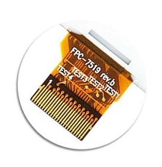

## FPC-7519 rev.b
It is demo code for LILYGO® TTGO T5 V2.2 ESP32 2.9" EPaper Plus module which has *FPC-7519 rev.b* mark on display flex cable.

Today ( 2021-030-16 ) non of the samples on official [TTGO repository](https://github.com/Xinyuan-LilyGO/LilyGo-T5-ink-series), nor [ZinggJM GxEPD](https://github.com/ZinggJM/GxEPD) library will support this type of display. 

BW - slack and white version
GRAY - 4 gray shades version

For audio demo please go https://github.com/elshnkhll/ULPSoundESP32
